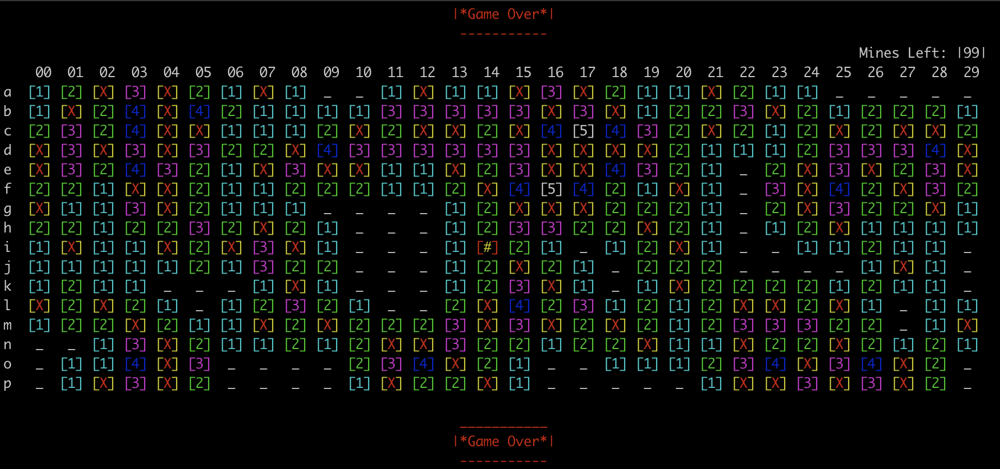

# Minesweeper in C
Sam Barton, April 2023
## What is this?
A console version of minesweeper, one of my favorite games to play in my spare time.
## Game Over

## Project Structure
```markdown
.
├── .gitignore
├── Makefile
├── README.md
├── build
│   ├── ARM-aarch64
│   │   ├── minesweeper
│   │   └── obj
│   │       ├── board.o
│   │       └── minesweeper.o
│   └── Mach-O
│       ├── minesweeper
│       └── obj
│           ├── board.o
│           └── minesweeper.o
├── img
│   └── game.png
├── src
│   ├── .gitignore
│   ├── Makefile
│   ├── board.c
│   ├── board.h
│   └── minesweeper.c
└── tests
    ├── .gitignore
    ├── minesweeper
    ├── minesweeper.o
    ├── testing.sh
    ├── unittest

9 directories, 21 files
```

